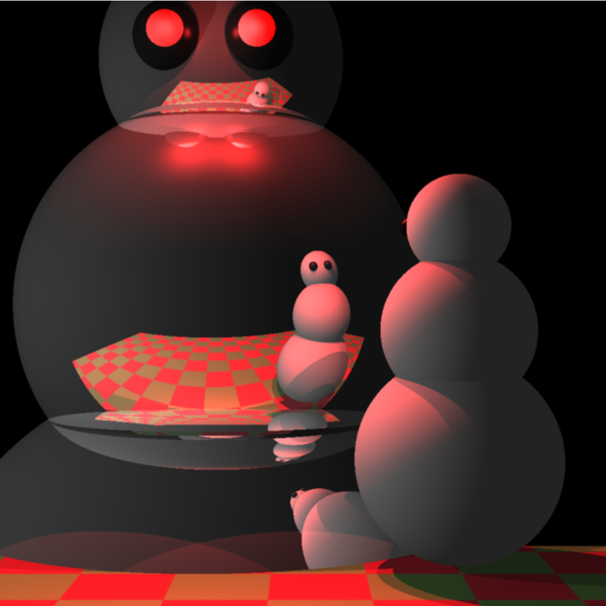

# scheme-art-contest-cs61a
Code for scheme art contest for UC Berkeley's CS 61A, Fall 2022.

1st place in heavyweight division of the Scheme Art Contest.



See https://inst.eecs.berkeley.edu/~cs61a/fa22/proj/scheme_gallery/#frosty-s-existential-dread

# Setup
Course instructions say to run `pip3 install abstract-turtle`

Undocumented dependecy is pillow and numpy: `python3 -m pip install pillow numpy`

# Usage
To run a scheme file with the course's scheme interpreter, run
```sh
python3 scheme contest.scm --pillow-turtle --turtle-save-path output
```

This runs the file `contest.scm` and saves the drawing output to the file `output`.

# Rendering
The main code is in `contest.scm`. Configure the various variables defined to adjust the scene and render settings.

## Parallel
The script `make_parallel.py` generates scheme files so that multiple instances of the interpreter can run in parallel.
When all processes are finished, it uses image magick to merge the images into the final result.

# Performance
I found PyPy to speed up rendering significantly compared to the standard CPython interpreter. I can't use Cython or Numba
or other compilers because the scheme interpreter from the course is obfuscated.